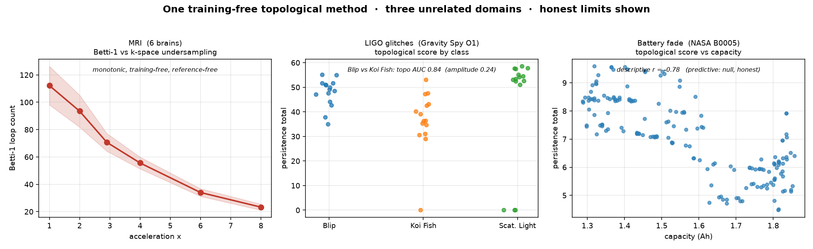

# Voodoo AOI — a training-free, token-free collapse engine

A topological "collapse" engine that reads structure in signals with **no training,
no tokens, and no neural network.** It runs offline on a laptop — if you don't have a
quantum sampler it falls back to local simulated annealing automatically, no account
or key required. Clone it, run it, get the numbers below.

> Built over five months by one person and an AI, and given to the world under
> copyleft. Institutions optimize for what they can measure; a lot of value falls
> through the cracks they can't see. This is a small tool for leveling that field.

---

## Reproducible results — run them yourself

These demos are **training-free topological analyses** (persistent homology). No model
is fit to any data. The same mathematical tool is applied across three unrelated
domains. **We show you where it fails, too — that's the point.**

### 1. Reference-free MRI quality (6 brains)
As MRI k-space is undersampled, image loop-topology (Betti-1) degrades monotonically —
no reference image, no training. Replicated across 6 brains (OpenNeuro ds000102):

| acceleration | 1× | 2× | 2.9× | 4× | 6× | 8× |
|---|---|---|---|---|---|---|
| Betti-1 (mean) | 112 | 94 | 71 | 56 | 34 | 23 |

`python demos/mri_qc.py`

### 2. LIGO glitch discrimination (Gravity Spy, O1) — a narrow positive
On the two most look-alike glitch classes, Blip vs Koi Fish, where peak amplitude
barely separates them (AUC 0.24), topology does (**AUC 0.84**).
**Honest limit:** on the easy, already-separable pairs a trivial spectral-bandwidth
feature beats topology. This is a *narrow* result, not a universal one.

`python demos/ligo_glitches.py`

### 3. Battery capacity fade (NASA PCoE) — descriptive, not predictive
Topology tracks capacity fade strongly (r ≈ −0.7 to −0.9 across cells).
**Honest limit:** it does **not** forecast *future* capacity beyond what you'd get from
current capacity + recent trend (partial r ≈ 0.04). Descriptive positive, predictive null.

`python demos/battery_predict.py`



---

## The engine

`engine/` is the full 96D octonion-collapse organism: entropy gating, Fano/octonion
projection, Jordan-Shadow decomposition, 33 transposable-element families,
Monster-moonshine grading, and chain-complex homology. Token-free, no LLM, runs offline.

```python
import numpy as np
from aoi_collapse_96d_dwave import aoi_collapse_96d_dwave

out = aoi_collapse_96d_dwave(np.random.normal(size=96))
print(out["betti"], out["intent"], out["chaos"], out["backend"])
# -> [..] 0.xx 0.xx SimulatedAnnealing
```

## Install

```bash
pip install -r requirements.txt
bash fetch_data.sh   # pointers to the public datasets
```

## License

**AGPLv3** (see `LICENSE`). You may use, modify, and redistribute freely; if you run a
modified version as a network service, you must release your source. Every copy carries
attribution (see `NOTICE`).
Commercial licensing (to use it without AGPL obligations): **james@lattice24.com**.

## Citation

James Jardine, *AOI Shell v1.1: Token-Free Domain-Agnostic Signal Organism via 96D
Octonion Collapse.* DOI [10.5281/zenodo.20200607](https://doi.org/10.5281/zenodo.20200607)

## Author

**James Jardine** — Lattice24 / VoodooAOI · james@lattice24.com
Built in collaboration with Claude (Anthropic).
